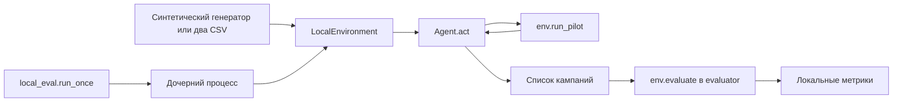

# Архитектура агента тарифных кампаний

## Цель

Подготовить небольшой агент, который через публичные данные и платные либо
бесплатные пилоты выбирает допустимые маркетинговые кампании с наибольшим
ожидаемым приростом ARPU после расходов на коммуникации.

Это техническая разведка от 23 сентября 2026 года, без реализации нового
алгоритма. В репозитории уже есть эвристический агент. База исследования —
коммит `13fd467`, текущие исходники среды и фактически имеющиеся CSV.
Во время проверки появились сторонние незакоммиченные изменения `agent.py`;
они не являются частью этой документационной задачи.

**Официальный пакет организаторов отсутствует.** [README](../README.md)
прямо называет среду, evaluator и данные командной разработкой. Поэтому
подтверждён ниже только локальный контракт. Точные ограничения, происхождение
файлов и вопросы к организаторам собраны в [constraints.md](constraints.md).
Числа локального симулятора не подтверждают качество на официальном кейсе.

Существующий путь исполнения:



Агент не должен вызывать `evaluate`, `summary` или читать приватное состояние
симулятора. Проверенный список API агента находится в `PUBLIC_API` файла
[tests/test_agent.py](../tests/test_agent.py).

## Входные данные

### Доступный API

Точка входа — синхронный `Agent().act(env)` из [agent.py](../agent.py).
Конструктор не требует аргументов. Метод возвращает `list[dict]`, а не CSV,
DataFrame, JSON-строку или генератор. Подробная схема вызова и результата —
в [публичном контракте](constraints.md#публичный-контракт).

| Вход | Назначение |
| --- | --- |
| `env.customer_profile` | Копия DataFrame с абонентами и четырьмя категориальными признаками для фильтров |
| `env.tariffs` | Копия DataFrame допустимых целевых тарифов |
| `env.channels` | Новый словарь каналов и стоимости одного контакта |
| `env.remaining_budget`, `env.remaining_contacts` | Текущие остатки общих ресурсов |
| `env.pilots_left`, `env.pilot_history` | Остаток успешных пилотов и копия их агрегированных результатов |
| `env.run_pilot(...)` | Единственный предусмотренный способ получить наблюдение об эффекте |

Таблицы следует считать снимком исходной базы: локальная среда не обновляет
`current_tariff` или `predicted_arpu` после контактов. После пилота меняются
ресурсы, история и внутренний учёт результата. Копирование публичных таблиц
защищает среду от изменений агентом.

### Инвентаризация файлов данных

Проверены отслеживаемые файлы и локальные файлы, включая игнорируемый
`demo_data/`. Файлов истории, дополнительных словарей или архивов с ними
в текущем репозитории не найдено.

| Набор | Фактически найдено | Вывод |
| --- | --- | --- |
| `customer_profile` | [demo_data/customer_profile.csv](../demo_data/customer_profile.csv), 23 441 × 6 | Синтетический снимок, не история |
| История смен тарифов | Отсутствует | Неизвестны колонки, даты, причины смен, длительность пребывания и ключи событий |
| `traffic` | Отсутствует | Нет временных рядов потребления, единиц и гранулярности |
| `arpu_monthly` | Отсутствует | Нет истории выручки и календарных месяцев; `predicted_arpu` её не заменяет |
| Словарь тарифов | [demo_data/tariff_dictionary.csv](../demo_data/tariff_dictionary.csv), 21 × 4 | Синтетические тарифы |
| Словарь признаков | Отдельный файл отсутствует | Имена и категории восстановлены из генератора и валидатора; бизнес-определения не подтверждены |
| Итоговые кампании | [submission.csv](../submission.csv), 3 × 7 | Демонстрационный выход, не обучающая выборка и не официальный шаблон |

Оба входных CSV полностью совпали с `build_demo_data()` при его параметрах
по умолчанию (`n_customers=23441`, `seed=2026`). `demo_data/` игнорируется Git
и может отсутствовать после клонирования. Без `--data-dir` среда вызывает
генератор в памяти; с `--data-dir` читает только два перечисленных CSV.
Аргумент `--seed` evaluator меняет эффекты/выборку пилота, а не seed генерации
базы. Источник: [generate_demo_data.py](../generate_demo_data.py),
`build_demo_data`, и [local_env.py](../local_env.py), `create_environment`.

### Профиль абонента

Типы ниже наблюдались при `pandas.read_csv` с pandas 3.0.1. CSV сам по себе
не фиксирует типы. Требования валидатора приведены отдельно в `constraints.md`.

| Колонка | Наблюдаемый тип | Содержание и ограничения интерпретации |
| --- | --- | --- |
| `customer_id` | `int64` | 23 441 уникальных ID, от 1 до 23 441; не доступен как фильтр кампании |
| `current_tariff` | `str` | Один из `tariff_1` … `tariff_21`; связь многие-к-одному с `tariff_id` |
| `arpu_segment` | `str` | `LOW`: 4 663, `MID`: 9 422, `HIGH`: 9 356 |
| `data_segment` | `str` | `NON_USER`: 3 527, `LITE`: 9 377, `HEAVY`: 10 537 |
| `call_segment` | `str` | `LOW`: 7 879, `MEDIUM`: 7 841, `HIGH`: 7 721 |
| `predicted_arpu` | `float64` | Базовый синтетический ARPU, диапазон 100,29–17 999,95; не фактическая месячная история |

Пропусков и дубликатов строк нет; `customer_id` уникален. Все 23 441 ссылки
на текущий тариф найдены в справочнике. У ARPU-сегмента средняя категория
называется `MID`, у звонков — `MEDIUM`; смешивать их нельзя.

Генератор сначала случайно выбирает ARPU-сегмент с вероятностями
`0.2 / 0.4 / 0.4`, затем генерирует и округляет ARPU в диапазонах
`LOW: [100, 999)`, `MID: [1000, 5000)`, `HIGH: [5001, 18000)`.
Это параметры синтеза до округления, а не официальные пороги классификации.
`data_segment` выбирается случайно с вероятностями `0.15 / 0.4 / 0.45`,
`call_segment` — равновероятно; числовых порогов по GB/минутам нет.
Текущий тариф выбирается случайно, без событий перехода.

Пересечения `arpu_segment × data_segment` образуют девять аудиторий
размером 726–4 291. Все помещаются в локальный лимит финальной кампании.
Полное пересечение четырёх категорий даёт 567 непустых групп. Это описание
этой выборки, не гарантия для будущей базы.

### Справочник тарифов и выходной CSV

| Колонка тарифов | Наблюдаемый тип | Фактические значения |
| --- | --- | --- |
| `tariff_id` | `str` | 21 уникальная строка `tariff_1` … `tariff_21` |
| `monthly_fee` | `float64` | От 700 до 15 000, шаг 715 |
| `data_gb` | `float64` | От 1 до 100, линейная сетка с округлением до 0,1 |
| `minutes` | `int64` | От 50 до 1 500, линейная сетка с приведением к целому |

Пропусков и повторов `tariff_id` нет. `monthly_fee` — месячная цена по имени
поля; GB и минуты — единицы, предполагаемые именами дополнительных полей.
Валюта, период пакетов и реальные условия тарифов документально не заданы.
Среда требует только `tariff_id` и `monthly_fee`; `data_gb` и `minutes`
не обязательны. Нельзя считать разницу абонентской платы эффектом кампании.

`submission.csv` содержит семь колонок из `CAMPAIGN_COLUMNS`. Пустые
`filter_call_segment` и `filter_current_tariff` означают отсутствие фильтра.
Обычный `read_csv` превращает их в `NaN`, который API не принимает:
для чтения экспорта пригоден `pd.read_csv(path, keep_default_na=False)`.
Готового обратного импортера кампаний в проекте нет.

### Подключение отсутствующих историй в будущем

До использования новых наборов надо получить их словари, установить ключи
абонента/тарифа, единицы, временную гранулярность и дату отсечения. Историю
смен, traffic и ARPU следует агрегировать до одной строки на абонента до
соединения с профилем; иначе связь многие-ко-многим размножит аудиторию.
Признаки давности смены, потребления и тренда ARPU допустимы только после
подтверждения полей и отсутствия данных из будущего. Сейчас такие признаки
не рассчитываются; отсутствующие данные не заменяются фиктивными нулями.
Даже полезный числовой признак не создаёт новый разрешённый фильтр `env`.

## Этап генерации кандидатов

Единица решения — `(набор фильтров аудитории, target_tariff, channel)`.
Размер аудитории вычисляется теми же правилами И/ИЛИ, что и у среды.
Произвольного списка ID, SQL-условия, числового порога ARPU или поля лимита
аудитории контракт не предоставляет.

Минимальный подход для следующего этапа разработки:

1. Проверить публичные таблицы, доступные категории, тарифы и цены каналов.
2. Начать с категориальных когорт; слишком большие делить разрешёнными
   фильтрами текущего тарифа и звонков. Не обрезать DataFrame до первых 5 000:
   возвращённые фильтры всё равно выберут исходную полную группу.
3. Посчитать точный размер, пересечения и доступность пилота. Группа меньше
   10 не годится для отдельного пилота, хотя финальная кампания может иметь
   от одного абонента. Для группы больше 5 000 пилот технически разрешён,
   но финальная аудитория потребует представимого разбиения.
4. Ограничить число вариантов для исследования. Тарифы и их признаки могут
   задавать порядок проверки, но знак эффекта определяется пилотом.

Непересекающиеся финальные аудитории упрощают учёт. Это выбранный принцип
и ожидание тестов агента, а не запрет локального evaluator на пересечения.
Имеющиеся `_Cohort`, `_cohorts`, `_fit_audience` — достаточные точки для
этой ответственности; новая абстрактная платформа сегментации не нужна.

## Этап пилотирования

Перед каждым вызовом проверять остатки пилотов, контактов, бюджета,
размер выбранной аудитории и резерв хотя бы для одной финальной кампании.
`run_pilot` списывает ресурсы сразу и сам выбирает абонентов случайно без
повторов внутри одного пилота. Между пилотами и финальными кампаниями
повторы возможны; ID участвовавших абонентов не возвращаются.

Сохранять наблюдение с точной комбинацией аудитории, тарифа и канала:
`n_customers`, среднее, выборочное стандартное отклонение, стоимость.
Для повторных пилотов объединять достаточные статистики, а не усреднять
средние без весов. Нельзя переносить результат одного канала на другой
как измеренный факт. Финальный кандидат должен иметь успешное наблюдение
на той же аудитории либо явно отмеченный перенос с более широкой группы.

Первый проход может распределять небольшой объём между кандидатами,
последующие — уточнять перспективные или неопределённые варианты.
Размеры проб и правило остановки пока являются проектными решениями.
В существующем агенте встречаются 60 контактов для первой пробы,
до 200 для повторной; это не обязательные размеры по контракту.

Обычный отказ локальной валидации до исполнения не списывает ресурсы.
Для неизвестной официальной среды это ещё надо подтвердить. После ошибки
надо перечитать публичные остатки/историю, не считать неуспешный вызов
доказательством эффекта и не повторять его неограниченно.

## Оценка ожидаемого результата и неопределённости

Для пилота с размером `n`, средним абсолютным приростом `m`, выборочным
отклонением `s` и ценой контакта `c`:

```text
SE = s / sqrt(n)
ожидаемый эффект отдельной кампании ≈ N × (m − c)
оценка с поправкой на риск = N × (m − k × SE − c)
```

`N` — фактический размер аудитории по фильтрам. `k` — параметр стратегии;
существующий агент использует `k=1` для финального ранжирования.
Это не обязательный коэффициент и не подтверждённая доверительная граница.
Эффект уже выражен в абсолютных единицах ARPU: повторно умножать `m`
на исходный ARPU нельзя. Стоимость вычитается один раз.

Для повторных наблюдений одной комбинации достаточно хранить:

```text
n_total = sum(n_i)
sum_x = sum(n_i × m_i)
sum_x2 = sum((n_i − 1) × s_i² + n_i × m_i²)
m_total = sum_x / n_total
s_total² = max(0, (sum_x2 − sum_x² / n_total) / (n_total − 1))
```

Так устроен существующий `_Observation`. Но `n_total` — число наблюдений,
не доказанное число уникальных абонентов. Повторные контакты, адаптивный
отбор лучших вариантов, малые выборки, множество сравнений и перенос
на суженную аудиторию ограничивают статистическую интерпретацию `SE`.
Формальная гарантия потребует отдельных предпосылок и проверки; здесь
достаточно явно обозначить неопределённость и не обещать прибыль.

Локальный итог отличается от суммы прогнозов кампаний: для каждого
затронутого абонента берётся лучший фактический эффект среди всех его
пилотных и финальных контактов; стоимость каждого контакта сохраняется.
Первый отрицательный эффект не заменяется нулём. Поэтому нельзя складывать
`pilot.net_gain` и прогнозы финала как точный итог или выдавать оценку
`N × m` за измеренный предельный эффект после уже проведённых пилотов.
Семантика метрик приведена в [constraints.md](constraints.md#учёт-результата).

## Выбор каналов

Источник доступности и цены — `env.channels`, не константы агента.
В текущей локальной среде `push=0`, `sms=4`, `digital_ads=22`, `call=160`
за контакт. Минимальные пилоты на 10 контактов стоят соответственно
0, 40, 220 и 1 600 условных денежных единиц.

Начинать можно с дешёвого канала, затем пилотировать альтернативы там,
где ожидаемая дополнительная польза оправдывает расходы на исследование.
Сравнивать следует прирост после стоимости, а не только средний uplift.
Нулевая цена push не отменяет расход контактов и возможный отрицательный
эффект. Порядок каналов по эффективности неизвестен заранее; имена и
множители эффектов из внутренностей симулятора не являются признаками.

## Распределение бюджета

Общий бюджет и контакты расходуются пилотами и финальными кампаниями
совместно. Проверки перед следующим действием:

```text
стоимость пилота = n × цена канала
стоимость финальной кампании = полный размер по фильтрам × цена канала
sum(контакты оставшегося плана) <= env.remaining_contacts
sum(стоимости оставшегося плана) <= env.remaining_budget
```

Повторное обращение к тому же абоненту снова расходует контакт и деньги.
Бюджет не пополняется полученным uplift. Нельзя резервировать «одного
произвольного абонента»: резерв должен покрывать аудиторию, которую
можно выразить поддерживаемыми фильтрами.

В существующей основной фазе исследования используются до 25% начального
остатка бюджета и до 2 000 контактов с дополнительным резервом финала.
Это эвристические настройки основной фазы, не лимиты кейса и не общий
контракт fallback. Для будущего решения достаточно отдельного счётчика
планируемых расходов и проверки всего плана перед возвратом.
На первом этапе не нужны отдельный сервис оптимизации или решатель MILP:
небольшой набор непересекающихся кандидатов допускает простой выбор
по оценке пользы с проверкой ресурсов, без заявления об оптимальности.

## Fallback-логика

| Ситуация | Предлагаемое поведение |
| --- | --- |
| Нет истории tariff/traffic/ARPU | Использовать только публичный профиль и пилоты, не выдумывать признаки |
| Кандидат слишком велик | Разделить разрешёнными категориями; если разделить нельзя, исключить |
| Пилот отклонён | Сверить остатки, исключить невалидное действие, сохранить ранее успешные наблюдения |
| Нет успешного пилота | Попробовать минимальный допустимый пилот при наличии ресурсов на него и финал; при невозможности сообщить об ошибке |
| Нет положительной оценки | Выбрать малую представимую аудиторию с лучшей доступной оценкой и пилотным основанием; возможен убыток |
| Осталось мало ресурсов | Сузить аудиторию фильтрами, заново посчитать размер и стоимость; пометить неопределённость переноса эффекта |
| Нет допустимой кампании после сужения | Явная ошибка; пустой список нарушает локальный минимум |
| Заканчивается время | Прекратить новые пилоты и проверить уже обоснованный план; дедлайн учитывать также в fallback |

Невозможно гарантировать допустимый план при любых входах: например,
ресурсов может не хватать даже на минимальный пилот и одну кампанию,
либо разрешённые категории не позволяют выделить подходящую аудиторию.
Бесплатный канал и предложение текущего тарифа не следует объявлять
универсально безопасными для ещё неизвестной официальной среды.

## Ограничения

Численные лимиты, форматы, запреты и различия между evaluator, README
и тестами перечислены в [constraints.md](constraints.md). Основные
архитектурные последствия: ограниченный API фильтров, всего 20 пилотов,
агрегированные ответы без индивидуальных исходов, общий расход ресурсов
и неподтверждённая совместимость с организаторским пакетом.

Существующий внутренний дедлайн 540 секунд проверяется в основной петле
пилотов, но не прерывает зависший чужой вызов. Локальная оболочка запускает
дочерний процесс с таймаутом до 600 секунд; запуск/очистка процесса могут
добавлять время. Новый внешний LLM, сеть, ключи и зависимости для этой
схемы не требуются и в рамках разведки не добавляются.

## Минимальная структура модулей

Предпочтительный старт — сохранить решение в `agent.py`: публичный `Agent`,
построение и проверка аудиторий, достаточные статистики пилотов, выбор плана.
Уже существующих небольших структур достаточно. Новые файлы Python сейчас
не создаются.

Только при росте объёма имеет смысл выделить один-два модуля:

| Модуль | Ответственность при необходимости выделения |
| --- | --- |
| `agent.py` | `Agent.act`, последовательность пилотов, учёт ресурсов, выбор кампаний и fallback |
| `candidates.py` (необязательный) | Подготовка публичных признаков, разрешённые фильтры, размеры и пересечения аудиторий |
| `pilot_stats.py` (необязательный) | Накопление `n/sum_x/sum_x2`, оценки среднего, ошибки и пользы |

`local_env.py`, `local_eval.py`, `generate_demo_data.py` и `make_submission.py`
остаются инфраструктурой локальной проверки, а не импортами агента.
Не нужны пакеты сервисов, хранилище, framework для агентов, отдельный
LLM-адаптер или конфигурационная система ради этих обязанностей.

## Команды проверки

Выполнять из корня `hack-deb8a427-cerebrum` с Python 3.11+ и зависимостями
из `requirements.txt` (`numpy==2.3.5`, `pandas==3.0.1`). Команды не требуют
экспорта нового submission или изменения evaluator.

```powershell
python -m unittest discover -s tests -v
python local_eval.py --data-dir demo_data --json
python local_eval.py --runs 10
python local_eval.py --runs 10 --scenario adverse
python local_eval.py --runs 10 --scenario channel_shift
python local_eval.py --agent agent_template
python local_eval.py --timeout 0.01
git diff --check
git diff -- local_env.py local_eval.py tests/test_local_env.py
git status --short
```

`--timeout 0.01` — намеренная проверка отказа, ожидается код 1. `--data-dir`
требует уже существующие CSV. `generate_demo_data.py` может создать их
в новом каталоге, но не перезаписывает существующие. `make_submission.py`
перезаписывает выходной CSV, поэтому для этой разведки он не запускался.

В текущем PowerShell команда `python` не обнаружена в PATH. Для фактически
выполненных проверок использован поставляемый с Codex интерпретатор:

```powershell
$reconPython = 'C:\Users\irrumi\.cache\codex-runtimes\codex-primary-runtime\dependencies\python\python.exe'
& $reconPython -B -m unittest discover -s tests -v
& $reconPython -B local_eval.py --data-dir demo_data --json
```

Результаты проверки 23 сентября 2026 года на наблюдавшемся рабочем дереве:

- Python 3.12.14, NumPy 2.3.5, pandas 3.0.1.
- CSV: схемы, уникальность, пропуски, ссылочная целостность и совпадение
  с генератором проверены чтением данных без перезаписи.
- `local_eval.py --data-dir demo_data --json`: `ok=true`, 3 кампании,
  20 пилотов, 10 775 контактов, стоимость 97 842, `net_gain=2708120.55`.
  Это только результат синтетического сценария `mixed`, seed 42.
- `unittest`: 17 из 18 тестов прошли. В
  `test_no_successful_pilot_never_returns_unvalidated_plan` ожидалась строка
  `No successful pilot`, а изменённый вне этой задачи `agent.py` выдал
  `No feasible pilot and final campaign`. Зафиксировано расхождение текста
  ошибки; агент и тесты в рамках разведки не исправлялись.
- Отдельная проверка API подтвердила типы результата, списание ресурсов,
  допустимость отсутствия имени кампании, непилотированного целевого тарифа
  после другого успешного пилота и пересекающихся финальных аудиторий.

Остальные команды выше — воспроизводимый план последующей проверки,
а не утверждение об их выполнении в этой разведке. Официальные тесты
недоступны. Для новых неотслеживаемых документов обычный `git diff` пуст:
до добавления в индекс их diff можно увидеть через
`git diff --no-index -- /dev/null docs/architecture.md` и аналогично для
`docs/constraints.md` (код 1 означает наличие различий).
